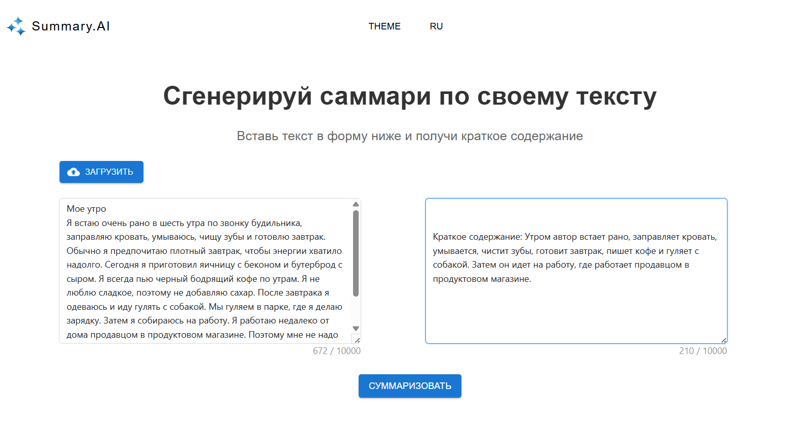

 # Summarization Service

Сервис для генерации суммаризаций текста с использованием FastAPI и PostgreSQL.

## 🚀 Features

- Генерация саммари текстовых данных
- RESTful API с документацией Swagger
- Интеграция с PostgreSQL

## 🛠️ Технологии

- Python 3.10+
- FastAPI
- SQLAlchemy 2.0
- PostgreSQL 14+
- Pydantic V2
- Uvicorn

## Preview



## ⚙️ Установка

1. Клонируйте репозиторий:
   ```bash
   git clone https://github.com/yourusername/summarization.git
   cd summarization
   ```
2. Установите модель.

3. Запустите проект

   ```
   docker compose up -build
   ```


